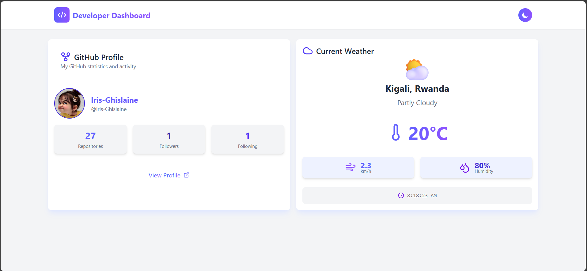
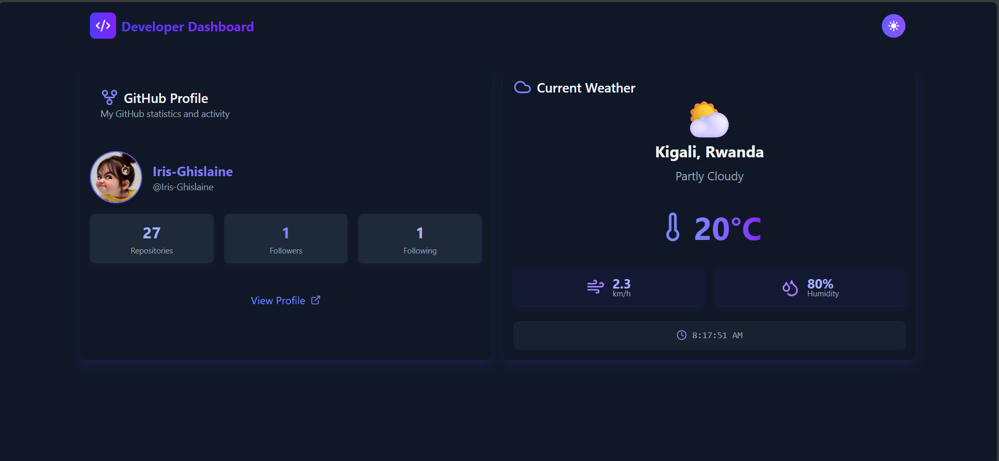

# Developer Dashboard

## Description

The **Developer Dashboard** is a responsive React application that displays real-time data from the GitHub and OpenWeatherMap APIs. It features a GitHub Profile Card showing user statistics (avatar, repositories, followers, following) and a Weather Card displaying current weather data (temperature, condition, wind speed, humidity, and time) for a specified city. The dashboard includes a Light/Dark mode toggle with persistent theme storage, built using Tailwind CSS for a modern, responsive design.

## APIs Used

- **GitHub API**: `https://api.github.com/users/Iris-Ghislaine`  
  Fetches user profile data, including avatar, repository count, followers, and following.
- **OpenWeatherMap API**: `https://api.openweathermap.org/data/2.5/weather`  
  Provides current weather data for a specified city (e.g., Kigali).

## Technologies Used

- **React**: For building reusable components and managing state.
- **Tailwind CSS**: For responsive, modern styling with dark mode support.
- **Axios**: For making API requests to GitHub and OpenWeatherMap.
- **Lucide-React**: For icons used in the UI.
- **Vite**: As the build tool for fast development and hot module replacement.

## Screenshots

# Light Mode



# Dark Mode



## Deployment Link

_Live Demo : `https://devop-dashboard.netlify.app/_`

## Setup Instructions

1. **Clone the Repository**:
   ```bash
   git clone `https://github.com/Iris-Ghislaine/developer-dashboard.git`
   cd developer-dashboard
   ```

## Install Dependencies:

```bash
npm install
```

## Run Project:

```bash
  npm run dev
```
Open `http://localhost:5173` in your browser to view the dashboard.

## Build for Production

```bash
  npm run build
```
## Folder Structure
```
developer-dashboard/
├── public/
│   ├── # Screenshots for README
├── src/
│   ├── components/
│   │   ├── GitHubCard.jsx        # GitHub profile card component
│   │   ├── WeatherCard.jsx       # Weather data card component
│   │   ├── Navbar.jsx            # Navigation bar with theme toggle
│   │   ├── ThemeToggle.jsx       # Theme toggle button component
│   │   ├── LoadingSpinner.jsx    # Loading spinner component
│   ├── App.jsx                   # Main app component
│   ├── index.css                # Tailwind CSS configuration
│   ├── main.jsx                 # Entry point
├── .gitignore                   # Git ignore file
├── vite.config.js               # Vite configuration
├── package.json                 # Project dependencies and scripts
├── README.md                    # Project documentation
```
## Features

- GitHub Profile Card: Displays user avatar, name, repositories, followers, and following, with a link to the GitHub profile.
- Weather Card: Shows current temperature, weather condition, wind speed, humidity, and local time for a specified city.
- Theme Toggle: Switches between Light and Dark modes, with the theme saved in localStorage for persistence.
- Responsive Design: Uses Tailwind CSS for a mobile-friendly, card-based layout with smooth transitions.
- Error Handling: Displays loading spinners and error messages for failed API requests.
- Version Control: Committed with descriptive messages (7+ commits) to GitHub.

## Notes

- Replace `Iris-Ghislaine` in App.jsx with your GitHub username.
- Update the city in the weather API call (e.g., q=Kigali) to your preferred city.

## Acknowledgments
Built as part of a React assignment to demonstrate API integration, state management, props, and theme switching. Special thanks to `Lucide-React` for icons and `Tailwind CSS` for styling.